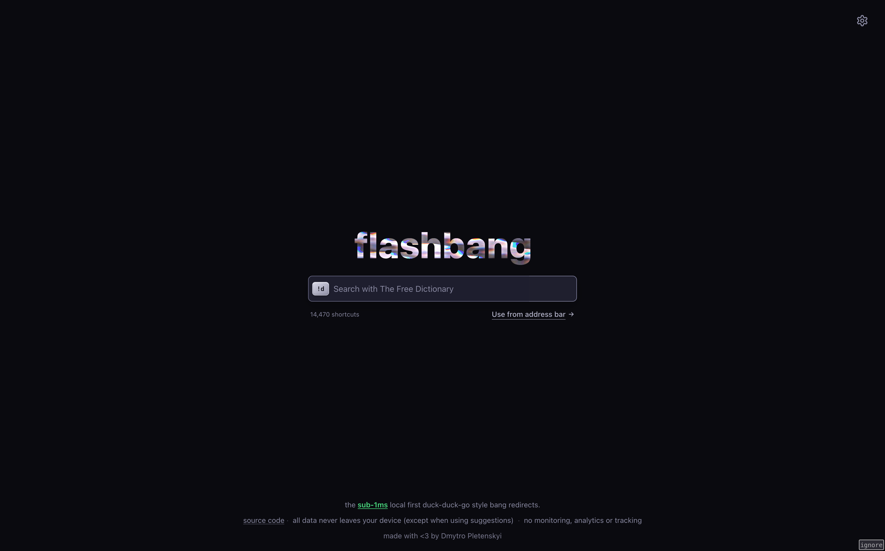

# flashbang

[](https://railway.com/deploy/flashbang?referralCode=cxTxcH&utm_medium=integration&utm_source=template&utm_campaign=generic)



Turn your browser's address bar into a shortcut launcher. Type `!g kittens` to search Google, `!w dogs` for Wikipedia, `!gh react` for GitHub — over 14,000 shortcuts (called "bangs") that take you straight to the right site, instantly. No extra tabs, no round-trips, no waiting for a page to load. Or use **snaps** — type `@w quantum` to search your default engine restricted to Wikipedia, `@gh api` for GitHub-only results.

Every other bang tool loads a full page before redirecting — adding hundreds of milliseconds — or routes through an edge server adding network latency. Flashbang skips the page entirely — a [Service Worker](https://developer.mozilla.org/en-US/docs/Web/API/Service_Worker_API) handles the redirect before your browser even starts rendering.

### Try it now

Visit **[flashbang-dyr.pages.dev](https://flashbang-dyr.pages.dev)** — if your browser supports [OpenSearch](https://developer.mozilla.org/en-US/docs/Web/OpenSearch), flashbang will appear in your search engine list automatically. Otherwise, add **`https://flashbang-dyr.pages.dev?q=%s`** as a custom search engine in your browser. Optionally, set **`https://flashbang-dyr.pages.dev/suggest?q=%s`** as the suggestion URL for address bar autocomplete. That's it.

> **Note for Microsoft Edge users:** Edge needs a one-time setup tweak (the auto-discovered entry has to be deleted and re-added manually) — see [Browser quirks](#browser-quirks). Without it, your default search engine gets overwritten after the first bang you use.

### Already using DuckDuckGo, Brave, or Kagi?

All three support bangs natively — but every query still round-trips through their servers before redirecting, adding significant network latency you can feel. Flashbang's Service Worker resolves the bang locally in sub 1ms and redirects before any network request leaves your machine. You also get bang-aware search suggestions in your address bar, custom bangs, feeling lucky, and it works in any browser — not just the one your engine ships with.

### Privacy

> Core redirects never leave your machine — the Service Worker handles them offline with no server involved. Search suggestions are completely optional and go through our server when enabled on the hosted version. A same-site cookie stores your configured suggestion provider and custom bang triggers so the server knows which upstream to proxy. A separate same-site cookie (`sf`) stores your top bang usage counts so suggestions can be personalized by frecency — it contains only bang triggers and hit counts (e.g. `g:50.yt:30`), no query content. No accounts, no sessions, no personal data. There is no tracking or analytics — we don't know what you search or what bangs you use. Cloudflare Pages exposes basic request counts in its dashboard as a platform feature we did not opt into and cannot disable. It contains no query content or personally identifiable information.
>
> If you'd rather not trust our server at all, Flashbang is fully self-hostable. Deploy to Cloudflare Pages/Railway in minutes or `docker run` it on any VPS — a single command gets you a fully private instance. See [Setup](#setup-as-search-engine) for details.

## Features

- **Built for speed** — Advertised as sub-1ms to be conservative, since technically, it could fall anywhere in this range, in my tests I have achieved median of `0.14ms` on `/bench` page in Chrome's Incognito window. That's the overhead Flashbang adds before your browser starts loading the destination — network time to reach the target site is the same regardless of which tool you use. The Service Worker intercepts requests before they hit the network, parses the bang, and responds with a 302 — no page load, no framework, no round-trip to a server. Don't trust our numbers? [Run the benchmark yourself](https://flashbang-dyr.pages.dev/bench) — results vary by machine
- **Zero runtime deps** — Ships without production npm dependencies; redirects run on plain browser APIs in the Service Worker
- **Private** — No analytics, no tracking. All data stays on your device for the core feature - redirects
- **14,000+ bangs** — Merged from DuckDuckGo, Kagi, and custom sources. Updated daily via automated CI
- **Custom bangs** — Add your own bangs through the settings UI. They take priority over built-ins
- **Search suggestions** — The only bang tool with bang-aware autocomplete in your browser's native address bar. Type `!y` and the browser itself suggests `!yt` (YouTube), `!ya` (Yandex), `!yf` (Yahoo Finance) — ranked by a combination of global popularity and your personal usage frequency. Regular queries return web search suggestions from Google, DuckDuckGo, Bing, Brave, or a custom provider. Both are unified through a single `/suggest` endpoint that plugs into your browser's built-in suggestion UI. Firefox-based browsers also render bang descriptions, site names, and favicons inline in the dropdown via `google:suggestdetail`. See [Browser quirks](#browser-quirks) for rendering and cookie differences across browsers
- **Frecency** — The Service Worker tracks which bangs you use and how often, entirely in-memory for zero redirect overhead. Your most-used bangs are promoted in autocomplete suggestions so they surface first. Frecency data is persisted to IndexedDB across Service Worker restarts. Available in Chromium-based browsers; not available in Firefox-based browsers — see [Browser quirks](#browser-quirks)
- **Snaps** — Type `@trigger query` to search your default engine with results restricted to that trigger's domain via `site:`. For example, `@w quantum` searches Google for `quantum site:en.wikipedia.org`. Works in prefix (`@w quantum`) and suffix (`quantum @w`) positions. A bare snap (`@w`) redirects to the trigger's homepage. Snaps reuse the same 14,000+ bang triggers — any bang can be used as a snap
- **Feeling Lucky** — Prefix a query with `\`, or add a bare `!` before or after it, to skip the results page and jump straight to the first result. Works with Google's "I'm Feeling Lucky" when that's your default engine, falls back to DuckDuckGo's `\` redirect for others. Configurable per-engine or with a custom URL, or disable it entirely
- **OpenSearch** — Browsers auto-discover Flashbang as a search engine via `/opensearch.xml`, including the suggestions endpoint. The XML is dynamically generated at request time using the current origin, so it works out of the box on any self-hosted domain or `localhost` — no hardcoded URLs to change

## Bang syntax

Flashbang supports 4 formats. All bangs are case-insensitive.

| Format              | Example      | Result                      |
| ------------------- | ------------ | --------------------------- |
| Prefix bang         | `!g kittens` | Google search for "kittens" |
| Suffix bang         | `kittens g!` | Google search for "kittens" |
| Prefix, query first | `kittens !g` | Google search for "kittens" |
| Suffix, bang first  | `g! kittens` | Google search for "kittens" |

If the query is just a bang with no search term (e.g. `!g`), Flashbang redirects to the service's homepage.

## Snap syntax

Snaps use `@` instead of `!` to perform a **site-restricted search** — your query goes to your default search engine with `site:domain` appended. Any bang trigger works as a snap. All snaps are case-insensitive.

| Format       | Example        | Result                                         |
| ------------ | -------------- | ---------------------------------------------- |
| Prefix snap  | `@w quantum`   | Default engine search for "quantum site:en.wikipedia.org" |
| Suffix snap  | `quantum @w`   | Default engine search for "quantum site:en.wikipedia.org" |
| Bare snap    | `@gh`          | Redirect to github.com homepage                |

If a query contains both a bang (`!`) and a snap (`@`), the bang takes precedence. Unknown snap triggers fall back to a normal default search.

### Feeling Lucky

Skip the search results page and go directly to the first result. Three syntax options:

| Format       | Example     | Result                     |
| ------------ | ----------- | -------------------------- |
| Backslash    | `\kittens`  | First result for "kittens" |
| Trailing `!` | `kittens !` | First result for "kittens" |
| Leading `!`  | `! kittens` | First result for "kittens" |

The redirect destination depends on your lucky provider (configurable in settings):

- **Default (match bang)** — Uses your default search engine's native lucky feature if available (Google `btnI`, DuckDuckGo `\`), otherwise falls back to DuckDuckGo's `\` redirect
- **Google** / **DuckDuckGo** / **Kagi** — Always use that engine's lucky redirect
- **Custom** — Provide your own URL template with `{}` as the query placeholder
- **Disabled** — Lucky syntax is treated as a normal search query

## Setup as search engine

> **Note:** Search suggestions and OpenSearch auto-discovery require a server endpoint since browsers don't route these requests through Service Workers — both are completely optional. Redirects always work offline once installed with no server needed. If you use the hosted version, these requests go through our Cloudflare Pages Functions. No queries are logged or stored — self-host if you'd rather keep them local too.

### Suggestion URL parameters

The suggestion endpoint accepts an optional `sp` (suggestion provider) query parameter to choose which search engine provides autocomplete results, without relying on cookies:

```
google, ddg, bing, brave, yahoo, ecosia, kagi, yandex, baidu, none
```

Example suggestion URL with a provider override:

```
https://flashbang-dyr.pages.dev/suggest?q=%s&sp=ddg
```

**Why this exists:** in Chromium-based browsers, cookies are sent with suggest requests and settings configured in the UI are picked up automatically — `sp` is rarely needed. In Firefox-based browsers, cookies are withheld and `sp` is the only way to pick a provider. See [Browser quirks](#browser-quirks) for details.

### Use the hosted version

A public instance is available at **[flashbang-dyr.pages.dev](https://flashbang-dyr.pages.dev)**. Just visit it, then add it as a custom search engine in your browser:

- **Search URL:** `https://flashbang-dyr.pages.dev?q=%s`
- **Suggestion URL:** `https://flashbang-dyr.pages.dev/suggest?q=%s` (Optional)

Nothing to build or deploy.

### Browser quirks

These apply equally to the hosted version and any self-hosted instance — worth a quick read before adding flashbang as your default.

- **Microsoft Edge — bang destinations hijack the default search.** After you use a bang like `!gm`, Edge auto-registers the destination (Google Maps, GitHub, etc.) as a separate search engine with the *same* shortcut as flashbang (the host). When two engines share a shortcut, Edge picks the most-recently-used one for default searches — so your plain queries start going to Google Maps. Not observed in Chrome or Firefox.

  **Fix** — in `edge://settings/searchEngines`:
  1. Delete the auto-discovered flashbang entry.
  2. Click **Add** and re-add it manually:
     - **Search engine:** `flashbang`
     - **Shortcut:** something short and unique like `f`
     - **URL with %s:** `https://flashbang-dyr.pages.dev?q=%s` (or your self-hosted URL)
  3. Set it as your default.

  **Important:** *editing* the auto-discovered entry's Shortcut doesn't persist — Edge re-derives it from `/opensearch.xml` on restart and reverts to the host. The delete-and-readd step is what makes the fix stick, because a manually-added entry is independent of the discovery XML.

- **Firefox / Zen / LibreWolf — no frecency, no custom bangs in suggestions.** Firefox-based browsers intentionally [withhold cookies from OpenSearch suggest requests](https://bugzilla.mozilla.org/show_bug.cgi?id=1624457) as a privacy measure. Flashbang's settings (default suggestion provider, custom bangs, frecency data) are stored in the cookie sent with `/suggest` requests, so none of those features are available in these browsers — suggestions fall back to Google with default popularity ranking. To pick a different suggestion provider, register the suggestion URL with the `sp` parameter (e.g. `…/suggest?q=%s&sp=ddg`) — see [Suggestion URL parameters](#suggestion-url-parameters).

- **Chromium — plain-text suggestions only.** Chrome, Edge, Arc, and other Chromium-based browsers don't render rich suggestion details (descriptions, favicons, entity images) for search-type suggestions from custom search engines; they're shown as plain text. Firefox-based browsers render the rich data passed through `google:suggestdetail`. This is a Chromium limitation, not flashbang's.

### Deploy your own

**Cloudflare Pages** (recommended) — supports both redirects and suggestions out of the box:

1. Deploy the repo to Cloudflare Pages with build command `bun run codegen --from-merged && bun run build` and output directory `dist`
2. The Pages Functions automatically handle `/suggest` (search suggestions) and `/opensearch.xml` (search engine discovery with correct origin) on the edge
3. Visit the site — your browser will auto-discover it via OpenSearch
4. Or manually add a custom search engine:
   - **Search URL:** `https://your-domain?q=%s`
   - **Suggestion URL:** `https://your-domain/suggest?q=%s`

**Railway** — detects the Dockerfile and deploys automatically:

1. Connect your repo on [Railway](https://railway.app)
2. Railway builds the Docker image and sets the `PORT` environment variable automatically
3. Connect domain (you can auto-generate it in settings)
4. Add a custom search engine:
   - **Search URL:** `https://your-app.up.railway.app?q=%s`
   - **Suggestion URL:** `https://your-app.up.railway.app/suggest?q=%s`

**Other static hosts** (Netlify, Vercel, etc.) — redirects work, but suggestions and dynamic OpenSearch require adding serverless functions for `/suggest` and `/opensearch.xml`. See `functions/` for the implementations — they reuse shared modules from `src/` and can be adapted to any serverless platform.

### Self-host with Docker (recommended)

Run your own instance on any VPS. No dependencies to install — just Docker:

```sh
docker build -t flashbang .
docker run -p 3000:3000 flashbang
```

The image uses a multi-stage build — fetches bang sources, builds assets, and produces a minimal runtime image. Static assets are pre-compressed with Brotli at build time and served automatically, falling back to uncompressed for clients that don't support it. The port is configurable via the `PORT` environment variable (`-e PORT=8080`). Set it as your browser's custom search engine:

- **Search URL:** `http://your-host:3000?q=%s`
- **Suggestion URL:** `http://your-host:3000/suggest?q=%s`

### Self-host without Docker

Requires [Bun](https://bun.sh). Service Workers need an HTTP origin (not `file://`), but a local server works fine:

```sh
bun run codegen && bun run build && bun run start
```

`bun run codegen` fetches the latest bang definitions from DuckDuckGo and Kagi and generates the JavaScript bang maps. `bun run build` bundles, minifies, and pre-compresses all static assets with Brotli into `dist/`. `bun run start` serves the production build locally. Visit the local URL once — the Service Worker installs and redirects work offline after that. Set it as your browser's custom search engine:

If generated bang artifacts are missing, `bun run build` and `bun run profile` automatically run `bun run codegen --from-merged` before continuing.

- **Search URL:** `http://localhost:3000?q=%s`
- **Suggestion URL:** `http://localhost:3000/suggest?q=%s` (Optional)

To pick up new bangs, pull the latest changes and re-run `bun run codegen`. If you host it, the daily GitHub Actions CI does this automatically.

The settings page has a copy button that gives you the exact search URL template.

## Settings

Open the settings modal from the gear icon on the home page, or type **`!settings`** in the address bar to jump there directly. Type **`!`** on its own to quickly access the home page.

- **Default bang** — The bang used when no `!` is in the query. Defaults to `g` (Google). Change it to `ddg`, `b`, or any valid bang trigger
- **Feeling Lucky** — Choose how lucky redirects resolve: Default (match your default bang), Google, DuckDuckGo, Custom (your own URL template with `{}` as query placeholder), or Disabled
- **Search suggestions** — Choose the source for address bar autocomplete: Default (matches your default bang), Google, DuckDuckGo, Bing, Brave, Custom (provide your own URL template with `{}` as query placeholder), or None
- **Custom bangs** — Add bangs with a trigger, name, and URL template (use `{}` as the query placeholder). Custom bangs override built-in ones
- **Search bangs** — Real-time search across all 14,000+ bangs by trigger, name, or domain
- **Import/Export** — Export your settings and custom bangs as JSON. Import to restore or sync across devices

All settings are stored in IndexedDB locally on your device.

## How it works

When you type `!gh react` in the address bar, the Service Worker intercepts the request before it reaches the network. It parses the bang trigger, looks it up in the bang map (checking custom bangs first, then built-ins), and responds with a 302 redirect. Snaps (`@trigger`) work the same way — the Service Worker resolves the trigger's domain and redirects to your default search engine with `site:domain` appended. If no bang or snap is found, your default search engine is used.

See [DEVELOPMENT.md](DEVELOPMENT.md) for build pipeline and project structure details.

## Comparison with other bang tools

|                             | **flashbang**                                 | **unduck**                       | **unduckified**                  | **rebang**                                             |
| --------------------------- | --------------------------------------------- | -------------------------------- | -------------------------------- | ------------------------------------------------------ |
| **Redirect method**         | Service Worker intercept                      | `window.location.replace`        | `window.location.replace`        | Cloudflare Worker (edge) + client fallback             |
| **When redirect happens**   | Before page renders (Service Worker)          | After page loads (HTML, CSS, JS) | After page loads (HTML, CSS, JS) | At the edge or after page loads (HTML, CSS, JS, React) |
| **Sources**                 | DDG + Kagi + custom                           | DDG                              | Kagi                             | DDG + Kagi                                             |
| **Analytics**               | None†                                         | Plausible                        | None‡                            | Plausible+Vercel Analytics+Vercel Speed Insights       |
| **Server required**         | No (redirects), yes (suggestions, OpenSearch) | No                               | No                               | Yes (Cloudflare Worker)                                |
| **Snaps (site: search)**    | Yes (`@trigger`)                              | No                               | No                               | No                                                     |
| **Feeling Lucky**           | Yes (configurable per-engine)                 | No                               | No                               | No                                                     |
| **Search suggestions**      | Yes (bang autocomplete + configurable)        | No                               | No                               | No                                                     |
| **OpenSearch**              | Yes (dynamic, self-host friendly)             | No                               | Yes                              | Yes                                                    |
| **Custom bangs**            | Yes (IndexedDB faster)                        | No                               | Yes (localStorage)               | Yes (localStorage)                                     |
| **Build tool**              | Bun                                           | Vite                             | Vite                             | Vite                                                   |
| **Bang data for redirects** | ~867 KB (trigger→URL only)                    | 2.7 MB (full metadata)           | 1.5 MB (full metadata)           | ~200 KB inline + 1.5 MB lazy-loaded                    |
| **Parsed on**               | SW thread (once, persists in memory)          | Main thread (every page load)    | Main thread (every page load)    | Main thread (every page load) or edge worker           |
| **License**                 | AGPL-3.0                                      | MIT                              | MIT                              | MIT                                                    |

† Flashbang doesn't include any analytics scripts or tracking. Cloudflare Pages exposes basic request counts in its dashboard for all hosted sites — this is a platform-level
metric we did not opt into and cannot disable. It is not Cloudflare Web Analytics.

‡ Unlike the unavoidable aggregate request counts exposed by Cloudflare Pages which applies both for flashbang and unduckified, issue [#13](https://github.com/taciturnaxolotl/unduckified/issues/13) in the Unduckified repository shows Cloudflare injecting `beacon.min.js`, which [Cloudflare documents as its Web Analytics beacon](https://developers.cloudflare.com/web-analytics/data-metrics/data-origin-and-collection/).
The author claims that Web Analytics have been disabled, but `beacon.min.js` is still being loaded, indicating that an analytics-related Cloudflare script remains present.

> **Note:** Comparison data is accurate at time of writing. These projects are actively developed and may have changed since.

## Why is it faster?

Every other bang tool (unduck, unduckified) — works the same way: your browser navigates to their page, loads HTML, parses and executes JavaScript (including a 1.5–2.7 MB bang database), and only then calls `window.location.replace()` to send you to your destination. You see it happen: there is a screen flash, their page briefly appears or flickers, and then you arrive where you wanted to go. That blank-page flash is the browser loading and executing their redirect page. It typically takes 100–500ms depending on your device, and it happens on every single redirect — even with all assets cached.

Flashbang works differently. A [Service Worker](https://developer.mozilla.org/en-US/docs/Web/API/Service_Worker_API) intercepts your navigation **before the browser starts rendering any page**. It parses the bang from the raw URL, looks it up in an in-memory map, and responds with a `302 redirect` — all in under 1ms. No page loads. No JavaScript bundle to parse. No white flash. Your browser goes straight from the address bar to your destination nearly as if you'd typed the URL directly.

The bang database (trigger→URL pairs, ~867 KB) is parsed once when the Service Worker installs and stays in memory across navigations — it is not re-parsed on every redirect. The settings UI is a separate bundle that only loads when you visit the homepage. During a redirect, the only code that runs is a lightweight parser and a hash-map lookup.

That lookup path is also pre-optimized by `scripts/codegen.ts` at build time. Instead of shipping a large plain JSON/object map, codegen splits bang URLs into deduplicated prefix/suffix tables, packs trigger/prefix/suffix lengths into typed arrays, and emits a precomputed open-address hash table (`lookupBang`) using FNV-1a + linear probing. At runtime, the Service Worker does direct table probing and string compare, then lazily materializes/caches URL parts only for matched entries. Codegen even tries multiple string-order layouts and picks the one with the best Brotli result (and eval-time tie-break), so the shipped module is tuned for both transfer size and cold parse/execute cost.

### Will I actually notice the difference?

Yes. Try it yourself: open unduck or unduckified, type `!g cats`, and watch the screen. You'll likely see a white flash or brief page load before Google appears. This is evident by the issues opened in unduckified repo [#6](https://github.com/taciturnaxolotl/unduckified/issues/6) and in unduck repo [70](https://github.com/T3-Content/unduck/issues/70). Now do the same with Flashbang. The browser navigates directly to Google — there is no intermediate page to see. The difference is immediately obvious, especially on mobile devices or enivronments where JavaScript parse time is higher.

[Run the benchmark yourself](https://flashbang-dyr.pages.dev/bench) to see measured redirect latency on your device.

## Acknowledgments

Flashbang was inspired by [unduck](https://github.com/t3dotgg/unduck) by Theo Browne, which demonstrated the value of fast client-side bang redirects. Bang data is sourced from [DuckDuckGo](https://duckduckgo.com/bang) and [Kagi](https://kagi.com).

## Daily updates

A GitHub Actions workflow runs every 24 hours at 00:00 UTC to fetch the latest bang definitions from DuckDuckGo and Kagi, rebuild the generated JSON, and commit any changes. This keeps the bang database current without manual intervention.

## Contributing

See [DEVELOPMENT.md](DEVELOPMENT.md) for prerequisites, build commands, and project structure.

## License

[AGPL-3.0](LICENSE) — see [NOTICE](NOTICE).

Flashbang is designed to be self-hosted and most of projects in this space bundle analytics. AGPL ensures that anyone who deploys a modified version must share their changes — protecting end users from forks that quietly add tracking or degrade privacy. The project introduces a genuinely novel approach (Service Worker intercept, two-tier bang data, bang-aware suggestions), and AGPL ensures derivatives contribute back rather than just extract.
